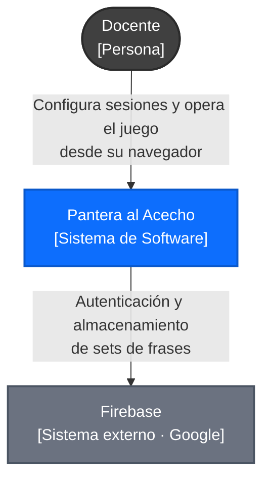
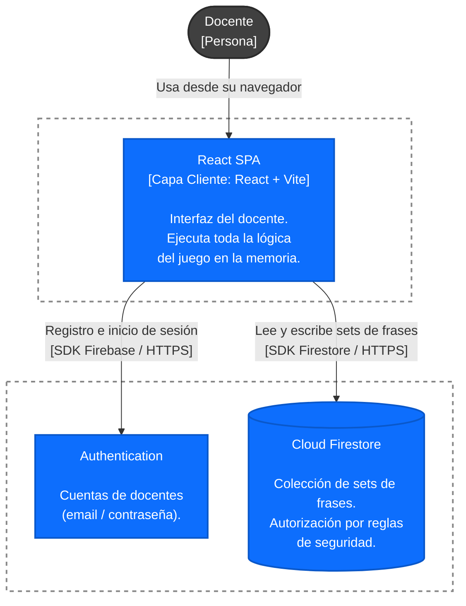
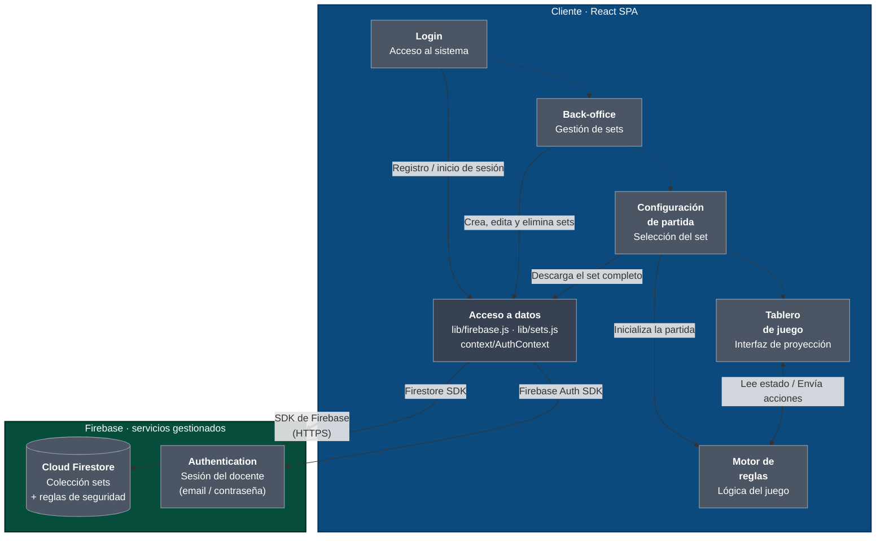

# Arquitectura - Pantera al Acecho

## 1. Visión general

El sistema es una Single Page Application (SPA) operada por un docente desde su computadora. Se compone de dos partes: el **cliente** (React, donde vive toda la lógica del juego) y los **servicios gestionados de Firebase** (Authentication para las cuentas de docentes y Cloud Firestore para los sets de frases). No hay servidor propio.

El **estado de la partida vive exclusivamente en la memoria del cliente**. Si el navegador se recarga durante el juego, la sesión se pierde. Firebase solo persiste datos de largo plazo: las cuentas de docentes y sus sets de frases.

---

## 2. Diagramas de arquitectura

### 2.1 Diagrama de Contexto
Muestra el sistema desde afuera: quién lo usa y de qué depende. No detalla tecnologías ni componentes internos.


```mermaid
flowchart TD
    A(["Docente<br/>[Persona]"]) -->|"Configura sesiones y opera el juego<br/>desde su navegador"| B["Pantera al Acecho<br/>[Sistema de Software]"]
    B -->|"Autenticación y almacenamiento<br/>de sets de frases"| C["Firebase<br/>[Sistema externo · Google]"]

    style A fill:#404040,stroke:#2b2b2b,stroke-width:2px,color:#ffffff
    style B fill:#0d6efd,stroke:#0a58ca,stroke-width:2px,color:#ffffff
    style C fill:#6b7280,stroke:#4b5563,stroke-width:2px,color:#ffffff
```

### 2.2 Diagrama de Capas
Muestra los bloques principales del sistema y cómo se comunican entre sí.


```mermaid
flowchart TD
    docente(["Docente<br/>[Persona]"])

    subgraph sistema ["Pantera al Acecho"]
        spa["React SPA<br/>[Capa Cliente: React + Vite]<br/><br/>Interfaz del docente.<br/>Ejecuta toda la lógica<br/>del juego en la memoria."]
    end

    subgraph firebase ["Firebase · servicios gestionados"]
        auth["Authentication<br/><br/>Cuentas de docentes<br/>(email / contraseña)."]
        fs[("Cloud Firestore<br/><br/>Colección de sets de frases.<br/>Autorización por reglas<br/>de seguridad.")]
    end

    docente -->|"Usa desde su navegador"| spa
    spa -->|"Registro e inicio de sesión<br/>[SDK Firebase / HTTPS]"| auth
    spa -->|"Lee y escribe sets de frases<br/>[SDK Firestore / HTTPS]"| fs

    style docente fill:#404040,stroke:#2b2b2b,stroke-width:2px,color:#ffffff
    style sistema fill:transparent,stroke:#888888,stroke-width:2px,stroke-dasharray: 5 5,color:#ffffff
    style firebase fill:transparent,stroke:#888888,stroke-width:2px,stroke-dasharray: 5 5,color:#ffffff
    style spa fill:#0d6efd,stroke:#0a58ca,stroke-width:2px,color:#ffffff
    style auth fill:#0d6efd,stroke:#0a58ca,stroke-width:2px,color:#ffffff
    style fs fill:#0d6efd,stroke:#0a58ca,stroke-width:2px,color:#ffffff
```

### 2.3 Diagrama de Módulos
Muestra el interior del cliente: los módulos que lo componen y las relaciones entre ellos.


```mermaid
flowchart TD
    subgraph Cliente["Cliente · React SPA"]
        Login["<b>Login</b><br/>Acceso al sistema"]
        BackOffice["<b>Back-office</b><br/>Gestión de sets"]
        ConfigPartida["<b>Configuración<br/>de partida</b><br/>Selección del set"]
        Tablero["<b>Tablero<br/>de juego</b><br/>Interfaz de proyección"]
        MotorReglas["<b>Motor de<br/>reglas</b><br/>Lógica del juego"]
        Datos["<b>Acceso a datos</b><br/>lib/firebase.js · lib/sets.js<br/>context/AuthContext"]

        Login -.-> BackOffice
        BackOffice -.-> ConfigPartida
        ConfigPartida -.-> Tablero
        ConfigPartida -->|"Inicializa la partida"| MotorReglas
        Tablero <-->|"Lee estado / Envía acciones"| MotorReglas
        Login -->|"Registro / inicio de sesión"| Datos
        BackOffice -->|"Crea, edita y elimina sets"| Datos
        ConfigPartida -->|"Descarga el set completo"| Datos
    end

    subgraph Firebase["Firebase · servicios gestionados"]
        Auth["<b>Authentication</b><br/>Sesión del docente<br/>(email / contraseña)"]
        Firestore[("<b>Cloud Firestore</b><br/>Colección sets<br/>+ reglas de seguridad")]
    end

    Cliente ==>|"SDK de Firebase<br/>(HTTPS)"| Firebase
    Datos -->|"Firebase Auth SDK"| Auth
    Datos -->|"Firestore SDK"| Firestore

    style Cliente fill:#0c4a7e,stroke:#083358,stroke-width:2px,color:#ffffff
    style Firebase fill:#064e3b,stroke:#022c22,stroke-width:2px,color:#ffffff
    style Login fill:#4b5563,stroke:#9ca3af,stroke-width:1px,color:#ffffff
    style BackOffice fill:#4b5563,stroke:#9ca3af,stroke-width:1px,color:#ffffff
    style ConfigPartida fill:#4b5563,stroke:#9ca3af,stroke-width:1px,color:#ffffff
    style Tablero fill:#4b5563,stroke:#9ca3af,stroke-width:1px,color:#ffffff
    style MotorReglas fill:#4b5563,stroke:#9ca3af,stroke-width:1px,color:#ffffff
    style Datos fill:#374151,stroke:#9ca3af,stroke-width:1px,color:#ffffff
    style Auth fill:#4b5563,stroke:#9ca3af,stroke-width:1px,color:#ffffff
    style Firestore fill:#4b5563,stroke:#9ca3af,stroke-width:1px,color:#ffffff
```

---

## 3. Módulos del cliente

Los módulos del cliente siguen un flujo secuencial: el docente inicia sesión, gestiona sus sets de frases, configura la partida y opera el tablero durante el juego.

### 3.1 Login
Pantalla de acceso al sistema. Permite a los docentes nuevos crear una cuenta (nombre, email, contraseña) y a los existentes ingresar sus credenciales. La autenticación la resuelve **Firebase Authentication** (proveedor email/contraseña) desde el propio cliente; no hay endpoint de login propio.

### 3.2 Back-office
Módulo privado accesible solo tras autenticación. Permite al docente crear, nombrar, editar y eliminar sets de frases, guardados en Firestore y vinculados a su cuenta. Crear y editar un set son páginas completas propias.

### 3.3 Configuración de partida
Pantalla previa al juego donde el docente selecciona el set de frases a usar e inicia la partida. Al iniciar, el cliente descarga de Firestore el set seleccionado completo (nombre + las 8 frases) y lo mantiene en memoria durante toda la sesión.

### 3.4 Tablero de juego
Interfaz de alta visibilidad optimizada para proyección en aula. Muestra el estado de los 4 equipos, el teclado virtual, la animación de la pantera y los controles del docente. Toda la lógica del juego, como la validación de letras y frases, corre aquí en memoria.

Para proteger contra recargas accidentales, el sistema detecta si hay una partida activa y activa la advertencia estándar del navegador ("¿Seguro que quieres salir?") si el docente intenta cerrar o recargar la pestaña, dándole una red de seguridad antes de perder la sesión.

### 3.5 Motor de reglas (cliente)

Módulo dentro del cliente que contiene toda la lógica de negocio del juego:

- Validación de letras y frases (normalización al momento: sin tildes ni mayúsculas)
- Control de límites de intentos por categoría y ronda
- Economía de monedas y lógica de Acierto Seguro
- Máquina de estados: sorteo, turnos, robo, repechaje, cierre

> **Nota sobre normalización:** Las frases se almacenan en Firestore con su ortografía correcta (tildes, mayúsculas) para mostrarse correctamente al final del turno. La normalización se aplica únicamente al momento de comparar la respuesta del equipo con la frase objetivo.

> **Nota sobre el modelo de amenaza:** La aplicación la opera el docente desde su propio equipo, proyectado al grupo. Los alumnos no tienen acceso al navegador ni a DevTools. Cargar las frases completas en el cliente no representa un riesgo de seguridad en este contexto. Las claves de configuración de Firebase que viajan en el bundle tampoco son secretas: la autorización real la imponen Firebase Auth y las reglas de Firestore (`firestore.rules`).

> **Nota técnica sobre la Ñ:** la normalización no usa un "strip" genérico de diacríticos Unicode (`texto.normalize('NFD').replace(/[̀-ͯ]/g, '')`), porque eso también le quita la virgulilla a la "Ñ" (que se descompone en NFD como N + U+0303) y la convertiría incorrectamente en "N". En español la Ñ es una letra propia, no una "N con tilde". La normalización usa en cambio un mapeo explícito solo de vocales acentuadas (Á→A, É→E, Í→I, Ó→O, Ú→U, Ü→U), dejando la Ñ intacta. Esto aplica tanto a la comparación de frases completas como a la clasificación de letras del teclado virtual (vocal/consonante).

#### 3.5.1 Implementación del motor

El motor se construyó como módulos JavaScript puros, sin dependencia de React, en `client/src/motor/`:

| Archivo | Responsabilidad |
| --- | --- |
| `constantes.js` | Todos los valores numéricos de `requerimientos.md` (saldos, costos, límites de intentos, premios) en un solo lugar |
| `normalizacion.js` | Normalización de texto/letras (con el manejo especial de la Ñ descrito arriba) |
| `letras.js` | Clasificación vocal/consonante, búsqueda de posiciones y letras únicas de una frase |
| `mazo.js` | Construcción del mazo con premios aleatorios (función aleatoria inyectable, para pruebas determinísticas) |
| `sorteo.js` | Barajado Fisher-Yates del orden de equipos (misma inyección de aleatoriedad) |
| `estadoInicial.js` | Construye el estado completo de una partida nueva a partir de un set de 8 frases |
| `reducer.js` | La máquina de estados en sí: un reducer puro `(estado, accion) => nuevoEstado`, que lanza `MotorError` ante acciones inválidas |
| `selectores.js` | Datos derivados para la UI (progreso de la frase revelada, si debe forzarse el Modo Adivinar, disponibilidad de Acierto Seguro) |
| `errores.js` | Clase `MotorError` |

Este reducer se conecta a React mediante un hook dedicado, `usePartidaEngine` (`client/src/hooks/`), que envuelve `useReducer` con un `reducerSeguro` que atrapa `MotorError` y lo guarda como `estado.error` en vez de dejarlo tumbar el render.

Dos hooks adicionales orquestan las pausas visuales que no son parte de la lógica de negocio en sí:

- `useVidaPerdida`: detecta cuándo la pantera de un equipo avanzó de estado, para disparar la vibración de pantalla y el video con sonido correspondiente.
- `useSecuenciasDramaticas`: detecta cuándo una carta se resolvió (con o sin ganador), para disparar la animación de victoria (si aplica) y la pausa de revelación de frase.

> **Restricción de implementación — `React.StrictMode`:** cualquier lógica que compare "estado actual vs. estado anterior" dentro de un componente o hook debe hacer esa comparación (y la mutación de la referencia que guarda el valor anterior) dentro de un `useEffect`, nunca directamente durante el render. Mutar una referencia durante el render se rompe bajo `StrictMode` (activo en `main.jsx`): React invoca la función de render dos veces seguidas para detectar impurezas, y si la referencia ya fue mutada por la primera invocación, la segunda "ve" el cambio como si ya hubiera ocurrido, perdiendo la detección. `useVidaPerdida` y `useSecuenciasDramaticas` siguen este patrón correctamente; es la referencia a seguir para cualquier lógica similar que se agregue después.

### 3.6 Componentes del Tablero (`client/src/components/tablero/`)

- `MazoCartas` — el mazo de 8 cartas.
- `PanteraDisplay` — el recuadro de la pantera; reproduce video con o sin sonido según si se está anunciando un nuevo estado o mostrando el estado en reposo.
- `ZarpazoOverlay` — la imagen de garra superpuesta a pantalla completa al llegar al estado 5.
- `EfectoImpacto` — la vibración de pantalla y el destello rojo al perder una vida.
- `Teclado`, `ProgresoFrase`, `RellenoInteligente` — el teclado virtual y las dos formas de mostrar/completar la frase (solo lectura y editable).
- `PanelRobo`, `PanelRevelacion`, `AnimacionVictoria`, `PanelCierre`, `PanelAdivinar`, `PanelRepechaje` — los distintos paneles que reemplazan el área de juego según el momento de la partida.
- `EquipoPanel` — el panel de cada equipo.
- `HojasDecorativas` — el follaje de fondo del tablero (SVG inline).

---

## 4. Autenticación (Firebase Authentication)

Registro e inicio de sesión de los docentes con proveedor **email/contraseña**. El flujo:

1. El cliente llama a `createUserWithEmailAndPassword` / `signInWithEmailAndPassword` del SDK de Firebase (`client/src/context/AuthContext.jsx`).
2. Al registrarse, se fija el nombre del docente con `updateProfile({ displayName })`.
3. Firebase persiste la sesión en el navegador. `onAuthStateChanged` mantiene sincronizado el estado (`{ uid, email, nombre }`) en el `AuthProvider`; hasta que resuelve, `ProtectedRoute` no decide ninguna redirección (evita un parpadeo a `/login` al recargar).
4. El SDK adjunta automáticamente el token de identidad en cada petición a Firestore; las reglas lo reciben como `request.auth`.

No se almacena ninguna contraseña ni hash: eso lo gestiona Firebase.

---

## 5. Persistencia (Cloud Firestore)

Una sola colección, `sets`, con un documento por set de frases:

```
sets/{setId} = {
  ownerUid, nombre, frases: [{ orden, texto }] (×8), createdAt, updatedAt
}
```

El acceso está encapsulado en `client/src/lib/sets.js` (`listarSets`, `obtenerSet`, `crearSet`, `actualizarSet`, `eliminarSet`), que usa el build **`firebase/firestore/lite`** (operaciones CRUD por petición, sin listeners en tiempo real — el docente solo edita sus propios sets y no hace falta sincronización viva; además pesa menos en el bundle).

La autorización vive por completo en `firestore.rules`: cada set solo es legible/modificable por su dueño (`ownerUid == request.auth.uid`) y solo puede crearse/actualizarse con exactamente 8 frases. El detalle de campos y reglas está en `modelo-datos.md`.

---

## 6. Comunicación entre capas

- Cliente → Firebase Auth: SDK de Firebase sobre HTTPS; el registro/login devuelven una sesión que el SDK guarda y renueva sola en el navegador.
- Cliente → Firestore: SDK de Firestore (lite) sobre HTTPS; cada operación lleva el token de identidad y se evalúa contra `firestore.rules`.
- El estado de partida **nunca sale del cliente**; es exclusivo de la sesión en memoria.

---

## 7. Stack tecnológico

| Capa | Tecnología |
|---|---|
| Frontend | React + Vite, react-router-dom |
| Autenticación | Firebase Authentication (email/contraseña) |
| Persistencia | Cloud Firestore (`firebase/firestore/lite`) |
| Animaciones | lottie-react |
| Pruebas (cliente) | Vitest, Testing Library, jsdom |
| Hosting | Firebase Hosting |

### 7.1 Estrategia de pruebas

El motor de reglas (lógica pura, sin React) se prueba con Vitest directamente: construcción de mazo, sorteo, normalización, clasificación de letras, y el reducer completo (turnos, robo, repechaje, cierre, victoria automática por letras).

Los componentes de React que orquestan las secuencias dramáticas (derrota, victoria, revelación, repechaje) se prueban con Vitest + Testing Library + jsdom, montando el `TableroJuegoPage` completo dentro de `React.StrictMode` (para que las pruebas atrapen el mismo tipo de problema descrito en 3.5.1) y simulando eventos reales (clics, el evento `ended` de un `<video>`, avance de temporizadores).

La capa de datos (Firebase Auth y Firestore) no tiene pruebas automatizadas: es una integración fina con un servicio externo que se verifica manualmente. Ningún archivo de prueba importa `client/src/lib/firebase.js`.

**Limitaciones del entorno de pruebas:**
- `jsdom` no implementa `<canvas>`, que `lottie-web` (usado por `lottie-react`) necesita al cargar. Se resuelve simulando (`vi.mock`) `lottie-react` globalmente en `client/src/test-setup.js`, en vez de instalar el paquete nativo `canvas` (frágil de compilar, sobre todo en Windows).
- `jsdom` no implementa `HTMLMediaElement.prototype.play/pause/load`; se sustituyen por stubs en `test-setup.js`.
- El JSON de Lottie se importa de forma estática (no con `import()` dinámico), por lo que queda incluido en el chunk principal.

---

## 8. Decisión de diseño

La decisión central de esta arquitectura es concentrar toda la lógica del juego en el cliente. Dado que la aplicación es operada exclusivamente por el docente desde su propio equipo y los alumnos no tienen acceso al navegador, no existe un riesgo real de manipulación. Esto permite descargar el set de frases completo al inicio de la partida y ejecutar toda la validación, el control de intentos y la economía de monedas en memoria.

La segunda decisión es no operar infraestructura propia. Como el backend solo tenía dos responsabilidades (autenticación y persistencia de sets), se sustituyó por servicios gestionados: Firebase Authentication y Cloud Firestore, con la autorización expresada en reglas declarativas. El resultado no tiene servidor ni base de datos que mantener, se despliega como un sitio estático en Firebase Hosting y su operación es gratuita a la escala de uso prevista (algunas decenas de docentes).
