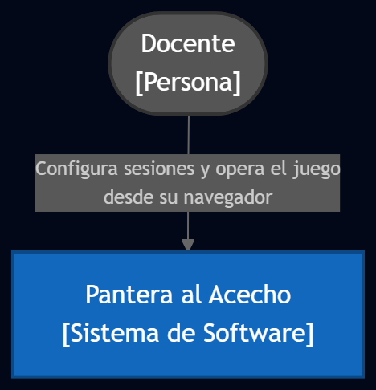
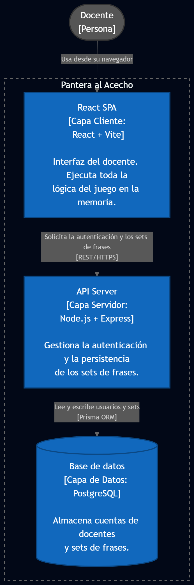
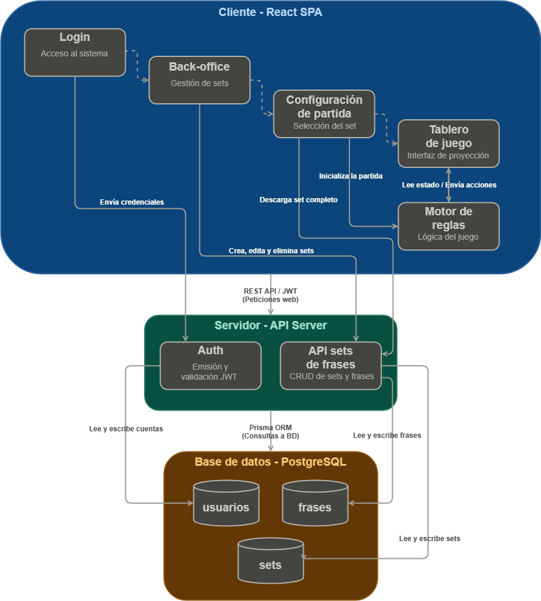

# Arquitectura - Pantera al Acecho

## 1. Visión general

El sistema es una Single Page Application (SPA) operada por un docente desde su computadora. Se compone de tres capas: cliente (React), servidor (Node.js + Express) y base de datos (PostgreSQL).

El **estado de la partida vive exclusivamente en la memoria del cliente**. Si el navegador se recarga durante el juego, la sesión se pierde. El servidor solo persiste datos de largo plazo: cuentas de docentes y sets de frases.

---

## 2. Diagramas de arquitectura

### 2.1 Diagrama de Contexto
Muestra el sistema desde afuera: quién lo usa y cuál es su propósito. No detalla tecnologías ni componentes internos.

### 2.2 Diagrama de Capas
Muestra los tres bloques principales del sistema (cliente, servidor y base de datos), las tecnologías que los conforman y cómo se comunican entre sí.

### 2.3 Diagrama de Módulos
Muestra el interior de cada capa: los módulos que la componen y las relaciones entre ellos. 

---

## 3. Módulos del cliente

Los módulos del cliente siguen un flujo secuencial: el docente inicia sesión, gestiona sus sets de frases, configura la partida y opera el tablero durante el juego.

### 3.1 Login
Pantalla de acceso al sistema. Permite a los docentes nuevos crear una cuenta (nombre, email, contraseña) y a los usuarios existentes ingresar sus credenciales para autenticarse.

### 3.2 Back-office
Módulo privado accesible solo tras autenticación. Permite al docente crear, nombrar, editar y eliminar sets de frases. Los sets quedan vinculados a su cuenta y disponibles para sesiones futuras. Crear y editar un set son páginas completas propias.

### 3.3 Configuración de partida
Pantalla previa al juego donde el docente selecciona el set de frases a usar e inicia la partida. Al iniciar, el cliente precarga el set seleccionado junto con todas las frases que lo componen, manteniendo esta información en memoria durante toda la sesión.

### 3.4 Tablero de juego
Interfaz de alta visibilidad optimizada para proyección en aula. Muestra el estado de los 4 equipos, el teclado virtual, la animación de la pantera y los controles del docente. Toda la lógica del juego, como la validación de letras y frases, corre aquí en memoria.

Para proteger contra recargas accidentales, el sistema detecta si hay una partida activa y activa la advertencia estándar del navegador ("¿Seguro que quieres salir?") si el docente intenta cerrar o recargar la pestaña, dándole una red de seguridad antes de perder la sesión.

### 3.5 Motor de reglas (cliente)

Módulo dentro del cliente que contiene toda la lógica de negocio del juego:

- Validación de letras y frases (normalización al momento: sin tildes ni mayúsculas)
- Control de límites de intentos por categoría y ronda
- Economía de monedas y lógica de Acierto Seguro
- Máquina de estados: sorteo, turnos, robo, repechaje, cierre

> **Nota sobre normalización:** Las frases se almacenan en la base de datos con su ortografía correcta (tildes, mayúsculas) para mostrarse correctamente al final del turno. La normalización se aplica únicamente al momento de comparar la respuesta del equipo con la frase objetivo.

> **Nota sobre el modelo de amenaza:** La aplicación la opera el docente desde su propio equipo, proyectado al grupo. Los alumnos no tienen acceso al navegador ni a DevTools. Cargar las frases completas en el cliente no representa un riesgo de seguridad en este contexto.

> **Nota técnica sobre la Ñ:** la normalización no usa un "strip" genérico de diacríticos Unicode (`texto.normalize('NFD').replace(/[\u0300-\u036f]/g, '')`), porque eso también le quita la virgulilla a la "Ñ" (que se descompone en NFD como N + U+0303) y la convertiría incorrectamente en "N". En español la Ñ es una letra propia, no una "N con tilde". La normalización usa en cambio un mapeo explícito solo de vocales acentuadas (Á→A, É→E, Í→I, Ó→O, Ú→U, Ü→U), dejando la Ñ intacta. Esto aplica tanto a la comparación de frases completas como a la clasificación de letras del teclado virtual (vocal/consonante).

#### 3.5.1 Implementación del motor

El motor se construyó como módulos JavaScript puros, sin dependencia de React, en `client/src/motor/`:

| Archivo | Responsabilidad |
| --- | --- |
| `constantes.js` | Todos los valores numéricos de `requerimientos.md` (saldos, costos, límites de intentos, premios) en un solo lugar |
| `normalizacion.js` | Normalización de texto/letras (con el manejo especial de la Ñ descrito arriba) |
| `letras.js` | Clasificación vocal/consonante, búsqueda de posiciones y letras únicas de una frase |
| `mazo.js` | Construcción del mazo con premios aleatorios (función aleatoria inyectable, para pruebas determinísticas) |
| `sorteo.js` | Barajado Fisher-Yates del orden de equipos (misma inyección de aleatoriedad) |
| `estadoInicial.js` | Construye el estado completo de una partida nueva a partir de un set de 8 frases |
| `reducer.js` | La máquina de estados en sí: un reducer puro `(estado, accion) => nuevoEstado`, que lanza `MotorError` ante acciones inválidas |
| `selectores.js` | Datos derivados para la UI (progreso de la frase revelada, si debe forzarse el Modo Adivinar, disponibilidad de Acierto Seguro) |
| `errores.js` | Clase `MotorError` |

Este reducer se conecta a React mediante un hook dedicado, `usePartidaEngine` (`client/src/hooks/`), que envuelve `useReducer` con un `reducerSeguro` que atrapa `MotorError` y lo guarda como `estado.error` en vez de dejarlo tumbar el render.

Dos hooks adicionales orquestan las pausas visuales que no son parte de la lógica de negocio en sí:

- `useVidaPerdida`: detecta cuándo la pantera de un equipo avanzó de estado, para disparar la vibración de pantalla y el video con sonido correspondiente.
- `useSecuenciasDramaticas`: detecta cuándo una carta se resolvió (con o sin ganador), para disparar la animación de victoria (si aplica) y la pausa de revelación de frase.

> **Restricción de implementación — `React.StrictMode`:** cualquier lógica que compare "estado actual vs. estado anterior" dentro de un componente o hook debe hacer esa comparación (y la mutación de la referencia que guarda el valor anterior) dentro de un `useEffect`, nunca directamente durante el render. Mutar una referencia durante el render se rompe bajo `StrictMode` (activo en `main.jsx`): React invoca la función de render dos veces seguidas para detectar impurezas, y si la referencia ya fue mutada por la primera invocación, la segunda "ve" el cambio como si ya hubiera ocurrido, perdiendo la detección. `useVidaPerdida` y `useSecuenciasDramaticas` siguen este patrón correctamente; es la referencia a seguir para cualquier lógica similar que se agregue después.

### 3.6 Componentes del Tablero (`client/src/components/tablero/`)

- `MazoCartas` — el mazo de 8 cartas.
- `PanteraDisplay` — el recuadro de la pantera; reproduce video con o sin sonido según si se está anunciando un nuevo estado o mostrando el estado en reposo.
- `ZarpazoOverlay` — la imagen de garra superpuesta al llegar al estado 5.
- `EfectoImpacto` — la vibración de pantalla y el destello rojo al perder una vida.
- `Teclado`, `ProgresoFrase`, `RellenoInteligente` — el teclado virtual y las dos formas de mostrar/completar la frase (solo lectura y editable).
- `PanelRobo`, `PanelRevelacion`, `AnimacionVictoria`, `PanelCierre`, `PanelAdivinar` — los distintos paneles que reemplazan el área de juego según el momento de la partida.
- `EquipoPanel` — el panel de cada equipo.

---

## 4. Módulos del servidor

### 4.1 Auth
Maneja el registro e inicio de sesión de los docentes. Al ingresar, el servidor emite una credencial de acceso (Token JWT) que el navegador del docente guarda localmente. Esta credencial se adjunta automáticamente en cada petición privada.

**Almacenamiento de la credencial:** Se guarda en el almacenamiento local del navegador por simplicidad. Al ser un sistema operado únicamente por el docente en su propio equipo y para un entorno universitario, este método es suficiente y simplifica el desarrollo.

### 4.2 API sets de frases
CRUD completo de sets de frases vinculados al usuario autenticado. Al iniciar una partida, el cliente descarga el set seleccionado completo con un único GET.

| Método | Ruta                  | Descripción                        |
|--------|-----------------------|-------------------------------------|
| GET    | /api/sets             | Listar sets del docente            |
| POST   | /api/sets             | Crear nuevo set                    |
| PUT    | /api/sets/:id         | Editar set existente               |
| DELETE | /api/sets/:id         | Eliminar set                       |
| GET    | /api/sets/:id/frases  | Obtener frases completas de un set |

Todas las rutas de sets están protegidas por el middleware de autenticación y verifican que el set pertenezca al usuario autenticado (devuelven 404, no 403, si el set existe pero es de otro docente, para no filtrar su existencia).

---

## 5. Base de datos

Motor: **PostgreSQL**
ORM: **Prisma**
Despliegue: **A definir**

### Tablas principales

- `usuarios` — cuentas de docentes
- `sets` — agrupaciones de frases vinculadas a un usuario
- `frases` — frases individuales pertenecientes a un set, almacenadas con ortografía correcta

> El modelo de datos detallado (campos, tipos, relaciones y restricciones) se documenta en `modelo-datos.md`.

---

## 6. Comunicación entre capas

- Cliente → Servidor: **REST API sobre HTTPS**, validando la identidad en cada petición mediante el Token JWT guardado en el navegador del docente.
- Servidor → BD: Las consultas se realizan mediante **Prisma ORM**, el cual gestiona automáticamente las conexiones para mantener el rendimiento del servidor.
- El estado de partida **nunca viaja al servidor**; es exclusivo del cliente durante la sesión.

---

## 7. Stack tecnológico

| Capa | Tecnología |
|---|---|
| Frontend | React + Vite, react-router-dom |
| Backend | Node.js + Express |
| Base de datos | PostgreSQL + Prisma |
| Autenticación | JWT |
| Animaciones | lottie-react |
| Pruebas (cliente) | Vitest, Testing Library, jsdom |
| Despliegue | A definir |

### 7.1 Estrategia de pruebas

El motor de reglas (lógica pura, sin React) se prueba con Vitest directamente: construcción de mazo, sorteo, normalización, clasificación de letras, y el reducer completo (turnos, robo, repechaje, cierre, victoria automática por letras).

Los componentes de React que orquestan las secuencias dramáticas (derrota, victoria, revelación) se prueban con Vitest + Testing Library + jsdom, montando el `TableroJuegoPage` completo dentro de `React.StrictMode` (para que las pruebas atrapen el mismo tipo de problema descrito en 3.5.1) y simulando eventos reales (clics, el evento `ended` de un `<video>`, avance de temporizadores).

**Limitaciones del entorno de pruebas:**
- `jsdom` no implementa `<canvas>`, que `lottie-web` (usado por `lottie-react`) necesita al cargar. Se resuelve simulando (`vi.mock`) `lottie-react` globalmente en `client/src/test-setup.js`, en vez de instalar el paquete nativo `canvas` (frágil de compilar, sobre todo en Windows).
- El JSON de Lottie se importa de forma estática (no con `import()` dinámico), por lo que queda incluido en el bundle principal (~913KB).

---

## 8. Decisión de diseño

La decisión central de esta arquitectura es concentrar toda la lógica del juego en el cliente. Dado que la aplicación es operada exclusivamente por el docente desde su propio equipo y los alumnos no tienen acceso al navegador, no existe un riesgo real de manipulación. Esto permite descargar el set de frases completo al inicio de la partida y ejecutar toda la validación, el control de intentos y la economía de monedas en memoria, sin depender del servidor durante el juego. Como resultado, el backend queda reducido a dos responsabilidades concretas (autenticación y persistencia de sets) lo que simplifica el desarrollo y elimina latencia en cada interacción.
